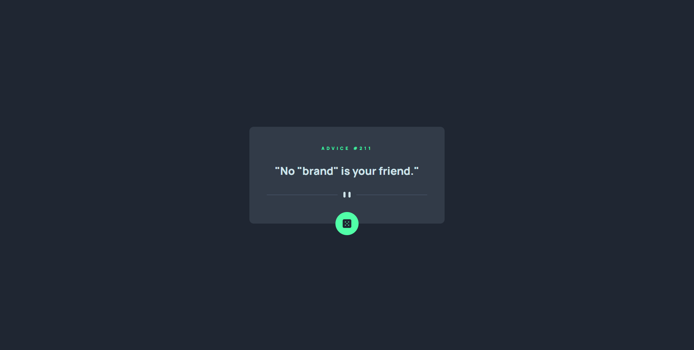
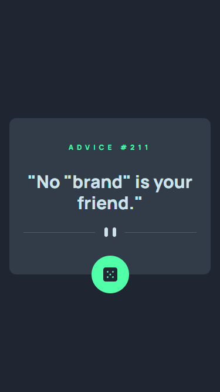

# Frontend Mentor - Advice generator app solution

This is a solution to the [Advice generator app challenge on Frontend Mentor](https://www.frontendmentor.io/challenges/advice-generator-app-QdUG-13db). Frontend Mentor challenges help you improve your coding skills by building realistic projects.

## Table of contents

- [Overview](#overview)
  - [The challenge](#the-challenge)
  - [Screenshot](#screenshot)
  - [Links](#links)
- [My process](#my-process)
  - [Built with](#built-with)
  - [What I learned](#what-i-learned)
  - [Continued development](#continued-development)
  - [Useful resources](#useful-resources)
- [Author](#author)

## Overview

### The challenge

Users should be able to:

- View the optimal layout for the app depending on their device's screen size
- See hover states for all interactive elements on the page
- Generate a new piece of advice by clicking the dice icon

### Screenshot

### Links

- Solution URL: [Add solution URL here](https://your-solution-url.com)
- Live Site URL: [Add live site URL here](https://your-live-site-url.com)

## My process

### Built with

- Semantic HTML5 markup
- CSS custom properties
- Flexbox
- [Vue.js](https://vuejs.org/) - JS framework
- [Tailwind Css](https://tailwindcss.com/) - CSS framework

### What I learned

Use Vue.js, Get data from third party api.
also I use tailwind css this challege, and learn how to customize default settings of tailwind css.

### Continued development

Use this section to outline areas that you want to continue focusing on in future projects. These could be concepts you're still not completely comfortable with or techniques you found useful that you want to refine and perfect.

### Useful resources

- [Introduction | Vue.js](https://vuejs.org/guide/introduction.html) - Tutorial of vue.js official page is really great. It's easy to understand.
- [Theme Configuration - tailwind css](https://tailwindcss.com/docs/theme) - How to customize tailwind css default themes.

## Author

- Github - [bundasse](https://github.com/bundasse)
