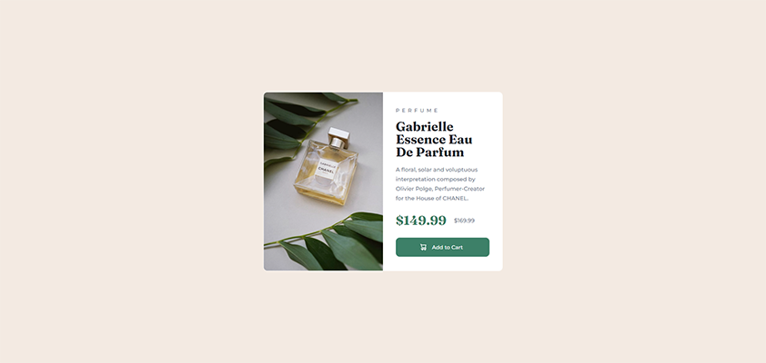
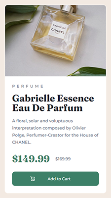

# Frontend Mentor - Product preview card component solution

This is a solution to the [Product preview card component challenge on Frontend Mentor](https://www.frontendmentor.io/challenges/product-preview-card-component-GO7UmttRfa). Frontend Mentor challenges help you improve your coding skills by building realistic projects. 

## Table of contents

- [Overview](#overview)
  - [The challenge](#the-challenge)
  - [Screenshot](#screenshot)
  - [Links](#links)
- [My process](#my-process)
  - [Built with](#built-with)
  - [What I learned](#what-i-learned)
  - [Continued development](#continued-development)
  - [Useful resources](#useful-resources)
- [Author](#author)

## Overview

### The challenge

Users should be able to:

- View the optimal layout depending on their device's screen size
- See hover and focus states for interactive elements

### Screenshot

A
### Links

- Solution URL: [solution URL](https://your-solution-url.com)
- Live Site URL: [live site URL](https://your-live-site-url.com)

## My process

### Built with

- Semantic HTML5 markup
- CSS custom properties
- Flexbox

### What I learned

Use media query and change background-image in mobile screen. And I got a comment 'use CSS grid/flex and rem/em units' in my previous work, so I use them this time.

### Continued development

simplify my CSS code more!

### Useful resources

- [CSS 미디어 쿼리 (Media Query) 사용법](https://www.daleseo.com/css-media-queries/) : Korean - I studied how to use media query with this article
- [Resizing background images with background-size](https://developer.mozilla.org/en-US/docs/Web/CSS/CSS_Backgrounds_and_Borders/Resizing_background_images)
- [Markdown Guide](https://gist.github.com/ihoneymon/652be052a0727ad59601) : Korean - This is my first markdown-text, so I studied some of markdown syntax this time. this is really fun! I want to be better at markdown next time.

## Author

- Github - [bundasse](https://github.com/bundasse)
